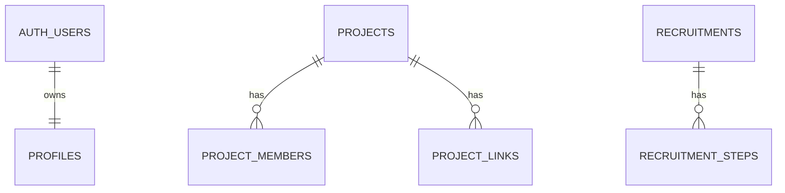

# DotG Supabase Database Schema

This schema stores DotG P0 public content and the database-backed administrator role model. The Next.js app still reads from TypeScript mock data in this phase; these tables prepare the local Supabase schema, seed data, and RLS boundary for later query and CRUD work.

## Tables

| Table | Role | Key Fields | Public Read | Manager Write | TypeScript Mapping |
| --- | --- | --- | --- | --- | --- |
| `profiles` | User role profile linked to Supabase Auth | `id`, `display_name`, `role` | None for anon; authenticated users can read own profile; admins can read all | Admin can update roles | New DB-only auth/admin model |
| `projects` | Project archive entries | `slug`, `title`, `summary`, `description`, `status`, `publication_status`, `tags`, `featured` | `publication_status = 'published'` | `editor`, `admin` | `Project`; DB adds `publication_status`, `sort_order`, audit fields, and `archived` status |
| `project_members` | Display-only project member rows | `project_id`, `name`, `role`, `sort_order` | Parent project must be published | `editor`, `admin` | `Project.members` |
| `project_links` | Project external links | `project_id`, `link_type`, `label`, `url`, `sort_order` | Parent project must be published | `editor`, `admin` | `Project.links`; DB uses `url`, TS uses `href` |
| `notices` | Notice posts | `slug`, `title`, `summary`, `content`, `pinned`, `publication_status`, `published_at` | `publication_status = 'published'` | `editor`, `admin` | `Notice`; DB adds publication/audit fields |
| `recruitments` | Recruitment campaign | `title`, `summary`, `status`, `is_current`, `target`, `qualifications`, `activities`, `application_url` | `publication_status = 'published'` | `editor`, `admin` | `Recruitment`; DB flattens `schedule` and `contact` |
| `recruitment_steps` | Ordered recruitment process | `recruitment_id`, `title`, `description`, `sort_order` | Parent recruitment must be published | `editor`, `admin` | `Recruitment.process` |
| `site_settings` | Singleton global site information | `id = 1`, `name`, `title`, `description`, `short_description` | Public | `editor`, `admin` | `siteConfig`; hero fields omitted because config has no current hero fields |
| `contact_items` | Contact display items | `label`, `value`, `href`, `description`, `is_active`, `sort_order` | `is_active = true` | `editor`, `admin` | `contactItems` |
| `social_links` | Social platform display items | `platform`, `label`, `url`, `description`, `is_active`, `sort_order` | `is_active = true and url is not null` | `editor`, `admin` | `socialLinks`; DB keeps missing URLs as `null` |

## Relationships

Foreign keys use `on delete cascade` for dependent content rows and `on delete set null` for audit columns. `site_settings` uses `id smallint primary key default 1 check (id = 1)` so only one row can exist. `recruitments_one_current_key` allows at most one row where `is_current = true`.

## Enums

| Enum | Values | Notes |
| --- | --- | --- |
| `content_status` | `draft`, `published`, `archived` | Public readers only see `published` content. |
| `project_status` | `planning`, `developing`, `released`, `archived` | TypeScript currently has `planning`, `developing`, `released`; DB reserves `archived` for later. |
| `project_link_type` | `github`, `website`, `download`, `youtube`, `steam`, `itchio` | Matches current TypeScript link type values. |
| `recruitment_status` | `upcoming`, `open`, `closed`, `always` | Matches current TypeScript recruitment status values. |
| `user_role` | `member`, `editor`, `admin` | New users default to `member`. |

## RLS Summary

| Role | Permissions |
| --- | --- |
| `anon` | Select published projects/notices/recruitments, child rows of published parents, `site_settings`, active contacts, and active social links with URLs. No writes and no profile access. |
| `authenticated member` | Same public reads plus own profile read. No content writes. |
| `editor` | Can manage content tables through `can_manage_content()`. Cannot manage profile roles. |
| `admin` | Can manage content and can read/update all profiles through `is_admin()`. |

All public schema tables have RLS enabled. Profile creation is handled by `public.handle_new_user()` on `auth.users`, always with role `member`.

## Seed Mapping Notes

The seed mirrors counts, slugs, status values, dates, ordering, member/link shape, site config shape, contact item count, and social platform list from the current mock data. Current source strings in several files are mojibake in the repository, so the seed uses concise local-development text while preserving stable identifiers and avoiding fake URLs. Project external links are empty in mock data, so no `project_links` rows are inserted. Social links use `url = null` and `is_active = false`.

## Future Work

- Keep public pages on Supabase queries while expanding settings, contact, and SNS data.
- Recruitment management uses `create_recruitment`, `save_recruitment`, `set_current_recruitment`, and `unset_current_recruitment` RPCs for atomic step saves and current recruitment changes.
- Implement admin CRUD for settings.
- Add Storage buckets and image upload flows.
- Link and deploy to the production Supabase project.
